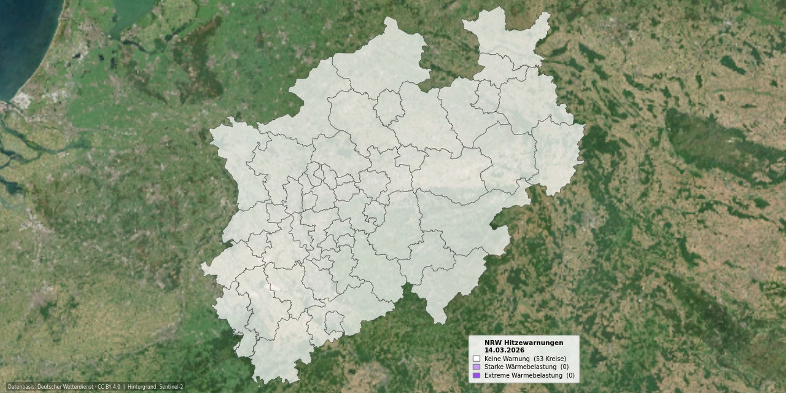

# NRW Hitzewarnungs-Karte

Tägliche automatische Visualisierung der DWD-Hitzewarnungen für alle 53 Kreise in NRW.



## Funktionsweise

| Schritt | Beschreibung |
|---------|--------------|
| **Trigger** | GitHub Actions, täglich 08:15 UTC (= 10:15 MESZ), 15 Min. nach DWD-Veröffentlichung |
| **Daten** | `hwtrend_YYYYMMDD.json` vom DWD Open Data Portal |
| **Hintergrund** | Sentinel-2 True Color Cloudless Mosaic (GeoTIFF, im Repo) |
| **Ausgabe** | `Hitzekarte_NRW_heute.jpg` · 1280 × 640 px |

## Warnstufen

| Stufe | Farbe | Bedeutung |
|-------|-------|-----------|
| 0 | ⬜ Weiß (70 % Deckkraft) | Keine Warnung |
| 1 | 🟣 Hellviolett `#cc99ff` | Starke Wärmebelastung |
| 2 | 🟣 Dunkelviolett `#9e46f8` | Extreme Wärmebelastung |

## Repo-Struktur

```
├── generate_map.py          # Hauptskript
├── requirements.txt         # pip-Abhängigkeiten
├── landkreise.geojson       # NRW-Kreisgrenzen (BKG)
├── background.tiff          # Sentinel-2-Satellitenbild (georef.)
├── Hitzekarte_NRW_heute.jpg # täglich aktualisierte Ausgabe
└── .github/workflows/
    └── hitzekarte.yml       # GitHub Actions Workflow
```

## Setup

1. Repo klonen / forken
2. `landkreise.geojson` und `background.tiff` im Repo-Root ablegen
3. Actions aktivieren – läuft dann automatisch täglich

## Lizenz

DWD-Daten: [CC BY 4.0](https://creativecommons.org/licenses/by/4.0/)  
> Datenbasis: Deutscher Wetterdienst, eigene Elemente ergänzt. Lizenz: CC BY 4.0
